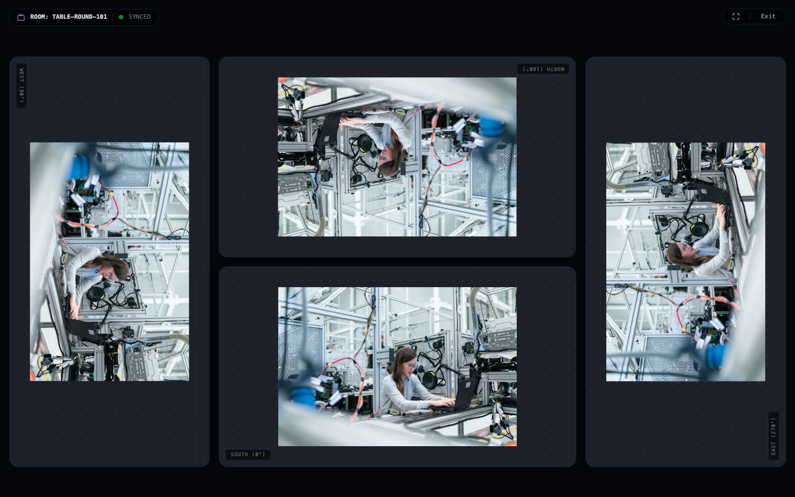
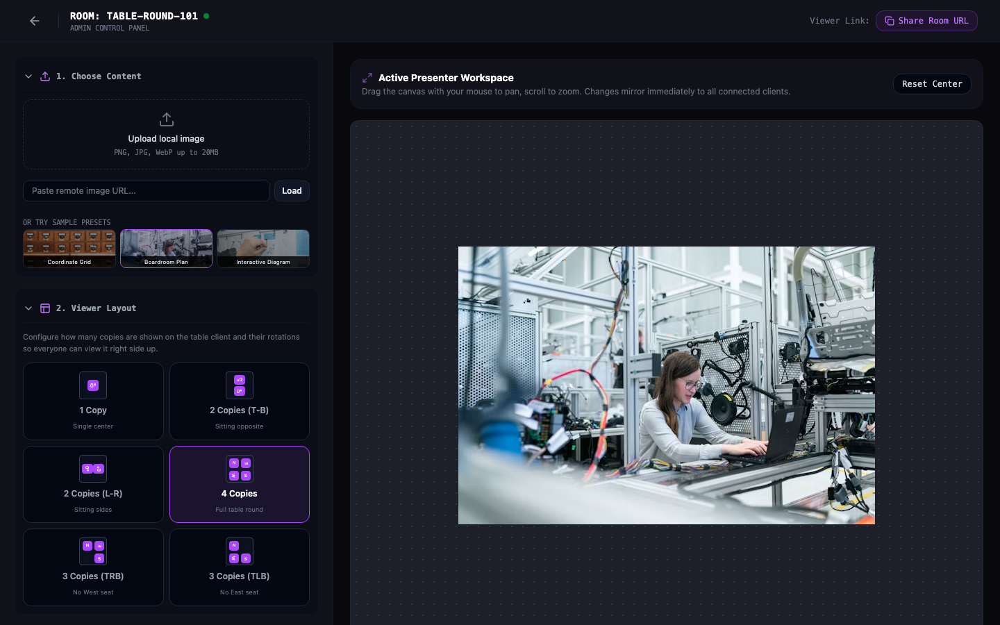
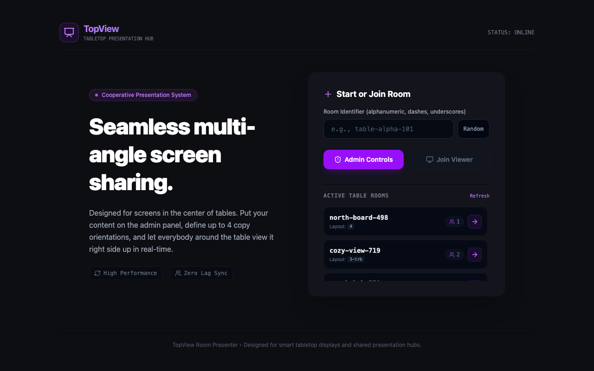

<div align="center">

# TopView

**Real-Time Cooperative Tabletop Presentation System**

Designed for screens placed flat in the center of tables. An admin controls image zooming, panning, and viewport layouts from a host dashboard, which instantly synchronizes over WebSockets to client displays arranged around the table — rendering right-side-up views at 0°, 90°, 180°, and 270°.

[](https://golang.org)
[](https://react.dev)
[](https://www.typescriptlang.org)
[](https://tailwindcss.com)
[](https://cloud.google.com/run)

[**Live Demo**](https://tabletop-presenter-598464211339.us-central1.run.app) • [**Features**](#features) • [**Architecture**](#architecture) • [**Quick Start**](#quick-start) • [**Deployment**](#deployment)

</div>

---

## Screenshots

### Client Presentation View (Tabletop Center Display)
Four synchronized viewports arranged for participants sitting at North (180°), South (0°), West (90°), and East (270°):



### Host Admin Dashboard
Interactive pan/zoom canvas, collapsible controls, and full-width live layout preview mirroring what players see in real-time:



### Home Page
Quick room creation, random room generator, and active table room directory:



---

## Features

- **Multi-Angle Synchronized Viewports**: Displays identical content right-side up for every participant around a tabletop display (orientations at 0°, 90°, 180°, and 270°).
- **Flexible Tabletop Layouts**:
  - `1`: Single center display (0°).
  - `2-tb`: Two copies stacked vertically: North (180°) and South (0°).
  - `2-lr`: Two copies side-by-side: West (90°) and East (270°).
  - `3-trb`: North (180°), East (270°), South (0°).
  - `3-tlb`: North (180°), West (90°), South (0°).
  - `4`: Full table round: North (180°), East (270°), South (0°), West (90°).
- **Smooth Canvas Controls**:
  - Drag to pan with pointer capture (gestures continue seamlessly even outside bounds).
  - Mouse wheel zoom and multi-touch pinch-to-zoom for touchscreens.
  - Reset center and quick zoom buttons.
  - Coalesced updates (`requestAnimationFrame`) to prevent network saturation.
- **Collapsible Admin Workspace**:
  - Clean accordion cards for content upload, layout selection, aspect ratio (`16:9`, `16:10`, `4:3`, `1:1`, `21:9`), and controls.
  - Dynamic full-sidebar live preview using shared geometry calculations.
- **Production-Hardened Backend**:
  - Single-binary Go server serving static SPA, REST API, and WebSocket hub.
  - Secure uploads with 20MB payload limit, extension allowlist, and MIME magic byte sniffing.
  - Role-based authorization ensuring only hosts can broadcast state changes.
  - Bounded write pump per connection with automatic eviction of stale coordinate frames under network lag.
  - Bi-directional 25-second keepalive heartbeats and activity-based deadline resets preventing proxy/NAT idle disconnects.
  - Hardened Dockerfile running as an unprivileged system user (`10001:10001`).

---

## Architecture

```
topview/
├── backend/                  # Go 1.22+ Server
│   ├── main.go               # HTTP routes, WebSocket hub, upload handler & SPA fallback
│   ├── main_test.go          # Unit, security, and concurrency race tests
│   └── go.mod
├── frontend/                 # React 19 + TypeScript + Vite 8 + Tailwind CSS v4
│   └── src/
│       ├── components/
│       │   ├── InteractiveCanvas.tsx   # Gesture engine (pan, wheel, pinch-to-zoom)
│       │   └── TabletopViewports.tsx   # Shared viewport geometry & orientation engine
│       ├── pages/
│       │   ├── Home.tsx                # Room directory & room creator
│       │   ├── Admin.tsx               # Presenter control panel & full-width preview
│       │   └── RoomClient.tsx          # Multi-angle presentation client
│       └── App.tsx
├── docs/                     # Documentation, specs & screenshots
└── Dockerfile                # Optimized multi-stage build (Node -> Go -> Alpine)
```

### WebSocket Protocol

- **Connection URL**: `/ws?roomId=<id>&role=<admin|client>`
- **Message format**: `{"type": "<type>", "payload": <RoomState>}`
- **Message Types**:
  - `init`: Sent by server immediately upon connection with current room state.
  - `state_update`: Sent by admin on canvas or layout change; broadcast to all clients in the room.
  - `ping` / `pong`: Connection heartbeats (exchanged every 25s).

---

## Quick Start

### Prerequisites
- [Go](https://golang.org/dl/) 1.22 or higher
- [Node.js](https://nodejs.org/) 20 or higher
- [npm](https://www.npmjs.com/)

### Local Development

1. **Clone the repository**:
   ```bash
   git clone git@github.com:moficodes/topview.git
   cd topview
   ```

2. **Start the Go Backend** (terminal 1):
   ```bash
   cd backend
   go run main.go
   ```
   *Listens on `http://localhost:8080`.*

3. **Start the Frontend Dev Server** (terminal 2):
   ```bash
   cd frontend
   npm install
   npm run dev
   ```
   *Runs Vite on `http://localhost:5173`, automatically proxying `/api`, `/ws`, and `/uploads` to `:8080`.*

4. Open `http://localhost:5173` in your browser.

---

## Testing & Quality Assurance

### Backend Tests (Race Detection & Static Analysis)
```bash
cd backend
go test -race -v ./...
go vet ./...
```

### Frontend Typecheck & Linting
```bash
cd frontend
npm run lint
npm run build
```

---

## Deployment

### Docker

Build and run locally with Docker:

```bash
docker build -t topview .
docker run -p 8080:8080 topview
```

### Google Cloud Run

To deploy on Cloud Run with an always-on instance for uninterrupted, long-lived WebSocket sessions:

#### 1. Configure Environment Variables
Set your Google Cloud project ID, region, Artifact Registry repository name, and image tag:

```bash
export PROJECT_ID="your-google-cloud-project-id"
export REGION="us-central1"
export AR_REPO="tabletop"
export IMAGE_TAG="v1.4.0"
```

#### 2. Enable Required APIs & Create Docker Repository
Enable Cloud Run, Cloud Build, and Artifact Registry APIs, and create the Artifact Registry Docker repository if you haven't already:

```bash
# Enable required Google Cloud services
gcloud services enable \
  run.googleapis.com \
  cloudbuild.googleapis.com \
  artifactregistry.googleapis.com \
  --project="${PROJECT_ID}"

# Create Artifact Registry Docker repository (if it doesn't already exist)
gcloud artifacts repositories create "${AR_REPO}" \
  --repository-format=docker \
  --location=us \
  --description="Docker repository for TopView" \
  --project="${PROJECT_ID}" 2>/dev/null || true
```

#### 3. Build & Deploy
Build the container image using Cloud Build and deploy to Cloud Run:

```bash
# Build and push container image via Cloud Build
gcloud builds submit \
  --project="${PROJECT_ID}" \
  --tag "us-docker.pkg.dev/${PROJECT_ID}/${AR_REPO}/presenter:${IMAGE_TAG}"

# Deploy to Cloud Run
gcloud run deploy tabletop-presenter \
  --project="${PROJECT_ID}" \
  --image="us-docker.pkg.dev/${PROJECT_ID}/${AR_REPO}/presenter:${IMAGE_TAG}" \
  --region="${REGION}" \
  --min-instances=1 \
  --max-instances=1 \
  --timeout=3600 \
  --no-cpu-throttling \
  --session-affinity \
  --allow-unauthenticated \
  --platform=managed
```

---

## License

This project is licensed under the [Apache 2.0 License](LICENSE).
